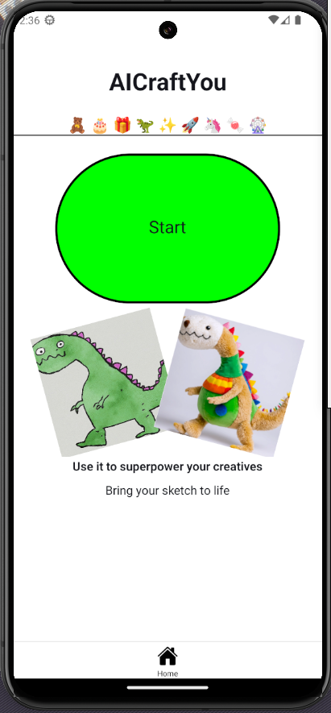

# AICraftYou - Proof of Concept
🧸 🎂 🎁 🦖 ✨ 🚀 🦄 🍬 🎡
---
Apply [stability.ai](https://stability.ai/) magic into your sketches to craft one of a kind toys, cakes and bring them to life by orderding for delivery.

Happy Crafting!!!



To run:

1. Follow the expo documentation to set up the development environment: [https://docs.expo.dev/get-started/set-up-your-environment/](https://docs.expo.dev/get-started/set-up-your-environment/)

2. Intall node packages ```npm i```

3. Then get api key at [https://platform.stability.ai/](https://platform.stability.ai/) and create a .env file with it.:
```
EXPO_PUBLIC_API_KEY=
```
4. Run the app in emulator:
- For Android: ```npm run android```
- For IOS: ```npm run ios```


